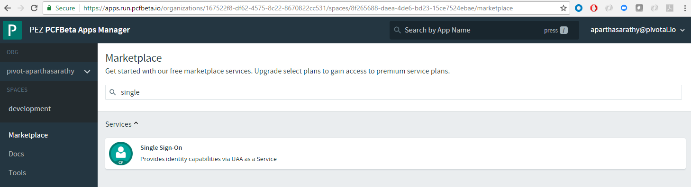
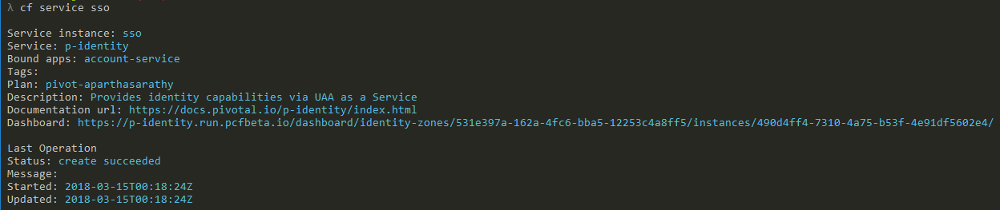
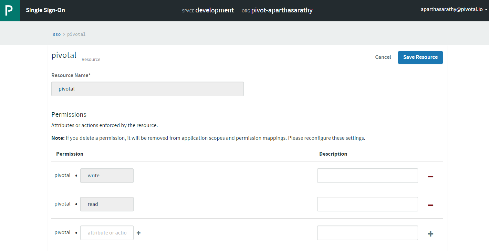
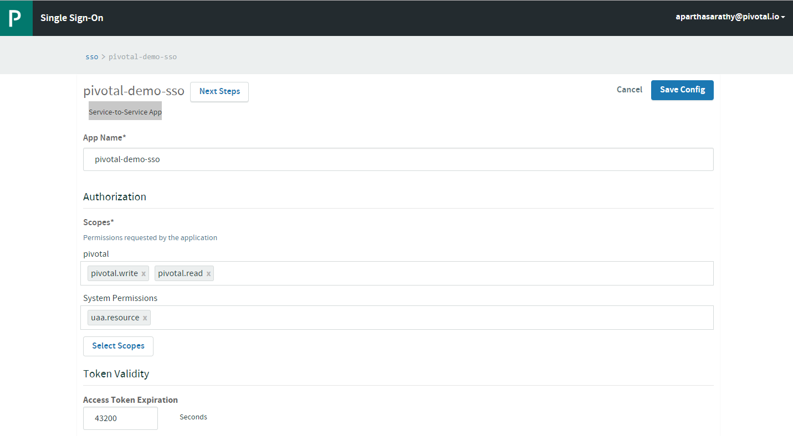
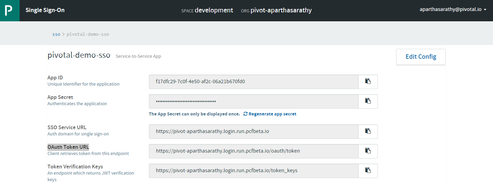
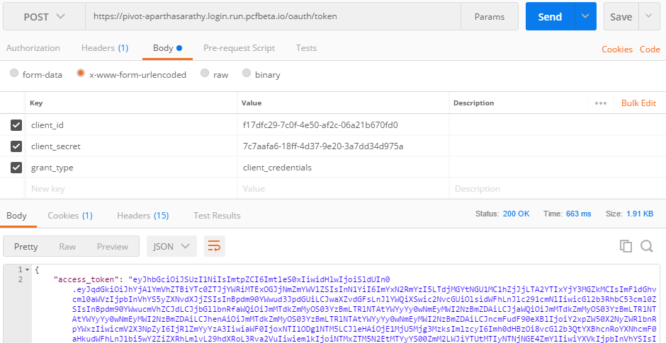
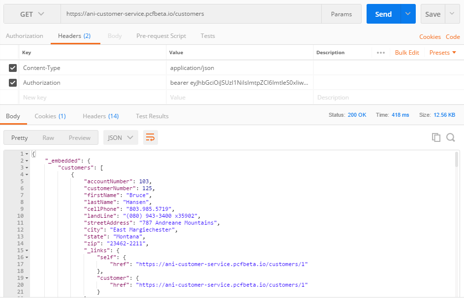
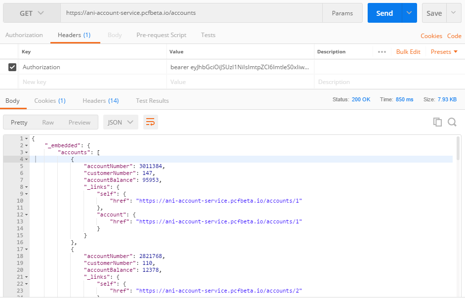

# SpringBoot Microservices using SCS and PCF SSO Tile

## This demo projects shows the following functions

 - How to use [Spring Cloud Services](http://docs.pivotal.io/spring-cloud-services/1-5/common/index.html)?
 - How to use [Single Sing-On](http://docs.pivotal.io/p-identity/1-5/) tile in PCF?
 - How to use [Service-to-Service App](http://docs.pivotal.io/p-identity/1-5/configure-apps/service-to-service-app.html)?

### OAuth 2.0 Actors
- **Application:** A client that makes protected requests using the authorization of the resource owner.
- **Authorization Server:** The Single Sign-On server that issues access tokens to client applications after successfully authenticating the resource owner.
- **Resource Server:** The server that hosts protected resources and accepts and responds to protected resource requests using access tokens. Applications access the server through APIs.

## Pre-requisite
1. First, create the _**Single Sing-On**_ service from the Marketplace . Go with the default options and create the service
1. From the `cf cli` you can grab the URL for this newly created service as follows 
1. When you come in for the first time to the above URL, there will be no _Apps_ or _Resources_
1. Now, let's create _resources_ 
1. After resources, let's create a _**Service-to-Service App**_. Ensure to select the _pivotal_ resources (or the resource created in the above step 4.) 
**Note:** Download the `App ID` and `App Secret` locally as you can copy it only the first time. Next time, you will be able to re-generate new `App Secret`. Copy the _**OAuth Token URL**_ as well. 


## **Scenario 1:** Not using SSO Tile in PCF
1. In this scenario, we do not bind the **customer-service** to the PCF SSO Tile. Rather, we only configure the following properties in the _**application.yml**_ and secure the micro-service

    ```yml
    AUTH_SERVER: https://pivot-aparthasarathy.login.run.pcfbeta.io/
    security:
    oauth2:
        resource:
        preferTokenInfo: false
        userInfoUri: ${AUTH_SERVER}/userinfo
        tokenInfoUri: ${AUTH_SERVER}/check_token
        jwk:
            key-set-uri: ${AUTH_SERVER}/token_keys
    ```
1. In our _java_ code below, we make use of _EnableResourceServer_ as well as, set a _resourceId_ explicitily. This ensures that, apart from checking the validity of the [JWT Token](https://jwt.io/), we also require the token to have the _required_ scope.

    ```java
    @Configuration
    @Profile({"sso"})
    @EnableResourceServer
    public class AuthConfig {
        @Value("${ssoScope:pivotal}")
        private String ssoResourceId;

        @Bean
        public GlobalMethodSecurityConfiguration globalMethodSecurityConfiguration() {
            return new GlobalMethodSecurityConfiguration() {
                @Override
                protected MethodSecurityExpressionHandler createExpressionHandler() {
                    return new OAuth2MethodSecurityExpressionHandler();
                }
            };
        }

        @Bean
        public RequestInterceptor requestInterceptor(){
            return new RequestInterceptor() {
                @Override
                public void apply(RequestTemplate requestTemplate) {
                    OAuth2AuthenticationDetails details = (OAuth2AuthenticationDetails)
                            SecurityContextHolder.getContext().getAuthentication().getDetails();
                    requestTemplate.header("Authorization", "bearer " + details.getTokenValue());
                }
            };
        }

        @Bean
        public ResourceServerConfigurer resourceServerConfigurerAdapter() {
            return new ResourceServerConfigurerAdapter() {
                @Override
                public void configure(ResourceServerSecurityConfigurer resources) throws Exception {
                    resources.resourceId(ssoResourceId);
                }

                @Override
                public void configure(HttpSecurity http) throws Exception {
                    http.addFilterAfter(new OncePerRequestFilter() {
                        @Override
                        protected void doFilterInternal(HttpServletRequest request,
                                                        HttpServletResponse response, FilterChain filterChain)
                                throws ServletException, IOException {
                            filterChain.doFilter(request, response);
                        }
                    }, AbstractPreAuthenticatedProcessingFilter.class);
                    http.csrf().disable();
                    http.authorizeRequests().anyRequest().authenticated();
                }
            };
        }
    ```
1. With this our app should be secured. If we invoke an API without valid token, you should see _**401 Unauthorized**_ response from the app.
1. First let's generate the token. Ensure [jq](https://stedolan.github.io/jq/) is installed.

    ```bash
    curl -s -X POST https://pivot-aparthasarathy.login.run.pcfbeta.io/oauth/token -H "Content-Type: application/x-www-form-urlencoded" -d "client_id=f17dfc29-7c0f-4e50-af2c-06a21b670fd0&client_secret=7c7aafa6-18ff-4d37-9e20-3a7dd34d975a&grant_type=client_credentials" | jq -r .access_token
    ```
1. If you don't have [jq](https://stedolan.github.io/jq/), you can use [Postman](https://www.getpostman.com/) 
1. Pass this _access_token_ in the Header when invoking `/customers` API 
1. If you pass a token without _pivotal_ resource id, you would receive a _**403 Forbidden**_ with a body

    ```json
    {
        "error": "access_denied",
        "error_description": "Invalid token does not contain resource id (pivotal)"
    }
    ```

## **Scenario 2:** Using SSO Tile in PCF
1. In this scenario, we will bind the **account-service** to the PCF SSO Tile. There is nothing related to _**security.oauth2**_ properties in the _application.yml_ rather, those properties get injected through VCAP as we bind to the _sso_ service in the _**manifest.yml**_

    ```yml
    ---
    applications:
    - name: account-service
    memory: 1024M
    path: ../../../build/libs/account-service-0.0.1-SNAPSHOT.jar
    host: ani-account-service
    instances: 1
    services:
    - config
    - registry
    - sso
    env:
        SPRING_PROFILES_ACTIVE: sso
        GRANT_TYPE: client_credentials
        SSO_SCOPES: pivotal.write, pivotal.read, spring.write, spring.read
        SSO_AUTHORITIES: pivotal.write, pivotal.read, spring.write, spring.read
        SSO_ACCESS_TOKEN_LIFETIME: 30
    ```
1. In our _java_ code below, we make use of _EnableResourceServer_. Please refer `customer-service` java code above for this.
1. Once we generate the token (refer to `customer-service` section above), we could invoke any REST API and validate the same. 

## Scenario 3: 3rd Party micro-service to call above secured micro-services
Let's say we have another micro-service [bff-service](https://samnewman.io/patterns/architectural/bff/) which calls both `account-service` and `customer-service`. To make it even more interesting, we could have 2 cases
- _**Case 1:** `bff-service` authorization token cannot be re-used because it doesn't have the required scope to call other microservices_
- _**Case 2:** `bff-service` is secured by some other type of security (for e.g. [ACL](https://en.wikipedia.org/wiki/Access_control_list#Networking_ACLs) based security)_

In both the above cases, we need to generate a token through the application, embed that in the HttpHeader before making a RESTTemplate call. In this example, I have used [Ribbon](https://cloud.spring.io/spring-cloud-netflix/multi/multi_spring-cloud-ribbon.html) with Eureka to invoke the call to ther microservices registered with Eureke
1. First generate _accessToken_ inside the code. This requires a valid _**client_id**_ and  _**client_secret**_. This is where we would use the values configured in the _Pre-requisite_ section above.

    ```java
    @Service
    @Slf4j
    public class TokenService {

        @Autowired
        RestTemplate restTemplate;

    /**
     * Get Access Token
     * @return TokenInfo
     */
    public TokenInfo getAccessToken() {
        log.info("Came inside getAccessToken()");
        HttpHeaders headers = getHeaders();
        MultiValueMap<String, String> map = new LinkedMultiValueMap<String, String>();
        map.add("client_id", oAuth2ClientConfig.getClientId());
        map.add("client_secret", oAuth2ClientConfig.getClientSecret());
        map.add("grant_type", oAuth2ClientConfig.getGrantType());

        HttpEntity<MultiValueMap<String, String>> request = new HttpEntity<MultiValueMap<String, String>>(map, headers);
        ResponseEntity<TokenInfo> tokenInfoResponseEntity = restTemplate.postForEntity(
                oAuth2ClientConfig.getAccessTokenUri(), request, TokenInfo.class);
        if (Objects.nonNull(tokenInfoResponseEntity)) {
            return tokenInfoResponseEntity.getBody();
        } else {
            log.error("No Access Token");
            return null;
        }
    }

    private HttpHeaders getHeaders() {
        HttpHeaders headers = new HttpHeaders();
        headers.setContentType(MediaType.APPLICATION_FORM_URLENCODED);
        return headers;
    }
    ```
1. Using the above method, we can use this generated token while _RESTTemplate_ calls to other microservices

    ```java
    @Service
    @Slf4j
    public class BFFService {

        @Autowired
        private RestTemplate restTemplate;

        @Autowired
        private TokenService tokenService;

        @Value("${CUSTOMER_SERVICE_URL}")
        private String URL_CUSTOMER_SERVICE;

        @Value("${ACCOUNT_SERVICE_URL}")
        private String URL_ACCOUNT_SERVICE;

        /**
        * BackEnd For Front-End method to aggregate data from 2 micro-services
        * @param customerNumber
        * @return
        */
        public UIResponse findCustomerDetailsByNumber(int customerNumber) {
            log.info("Came inside findCustomerDetailsByNumber for customerId: " + customerNumber);
            StopWatch stopWatch = new StopWatch();
            stopWatch.start();

            UIResponse uiResponse = null;

            log.info("Querying the customer microservice...");
            HttpHeaders httpHeaders = tokenService.getHeadersWithAccessToken();
            HttpEntity<String> entity = new HttpEntity<String>("parameters", httpHeaders);

            String uri = URL_CUSTOMER_SERVICE + customerNumber;
            log.info("Calling URI: " + uri);
            ResponseEntity<Customer> customerResponseEntity = restTemplate.exchange(
                    uri, HttpMethod.GET, entity, Customer.class);
            stopWatch.stop();

            if (Objects.nonNull(customerResponseEntity)) {
                Customer customer = customerResponseEntity.getBody();
                log.info("customer micro-service took " + stopWatch.getTotalTimeMillis() + " milliseconds");
                log.info("customer micro-service returned " + customer.toString());

                uiResponse = new UIResponse(customer.getFirstName(), customer.getLastName(), customer.getAccountNumber());
                uiResponse.setContact(new Contact(customer.getCellPhone(), customer.getLandLine(),
                        customer.getStreetAddress(), customer.getCity(), customer.getState(), customer.getZip()));

                //Now make Account service call
                stopWatch = new StopWatch();
                stopWatch.start();
                uri = URL_ACCOUNT_SERVICE + customerNumber;
                log.info("Calling URI: " + uri);
                ResponseEntity<List<Account>> accountResponseEntity = restTemplate.exchange(
                        uri, HttpMethod.GET, entity, new ParameterizedTypeReference<List<Account>>() {});
                stopWatch.stop();
                log.info("account micro-service took " + stopWatch.getTotalTimeMillis() + " milliseconds");

                if (Objects.nonNull(accountResponseEntity)) {
                    List<Account> accounts = accountResponseEntity.getBody();
                    log.info("account micro-service returned " + accounts.toString());
                    uiResponse.setAccounts(accounts);
                }
            }

            return uiResponse;
        }
    ```